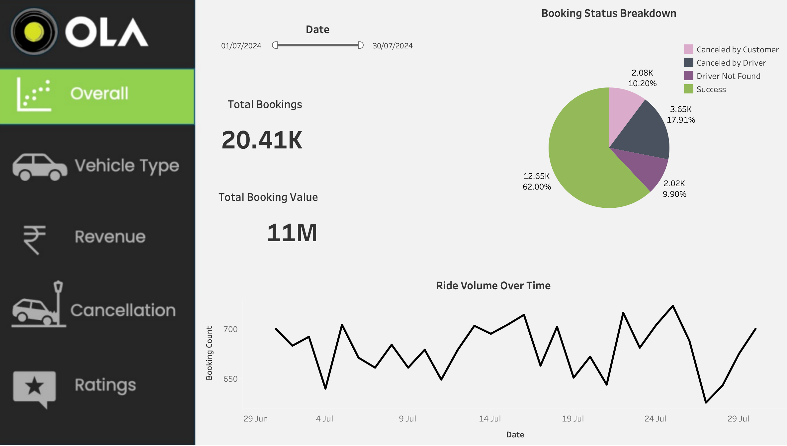
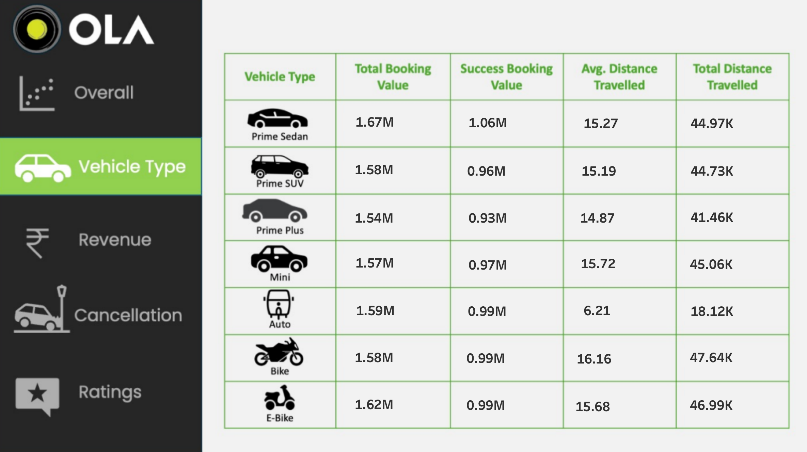
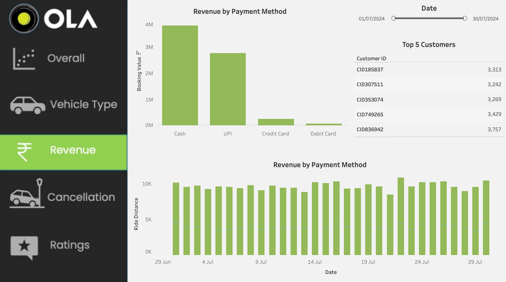
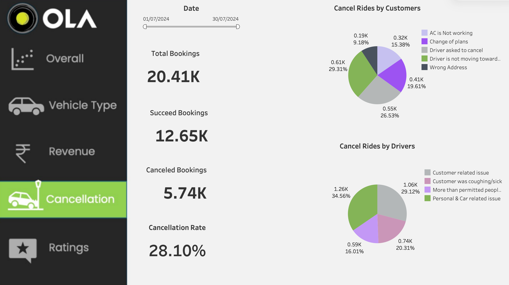
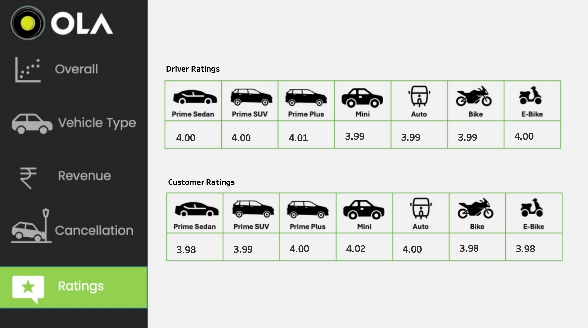

# OLA Ride Hailing Data Analysis

## Objective
Analyze OLA ride hailing booking data to understand booking trends, cancellation behavior, revenue performance, and user experience. The goal is to extract practical insights that can help improve ride success rates and operational efficiency.

## Dataset Overview
- **Total bookings:** 20,410  
- **Successful rides:** 12,650  
- **Cancelled rides:** 5,740  
- **Cancellation rate:** 28.1%  
- **Total booking value (successful rides):** 11M  

---

## Tools & Technologies
- **SQL (PostgreSQL)**
- **Excel**
- **Tableau**

---

## Dashboards

### 1️⃣ Overall Performance

**Highlights**
- Total bookings and booking value overview  
- Booking status split (Success vs Cancellations)  
- Daily ride volume trend  

---

### 2️⃣ Vehicle Type Analysis

**Highlights**
- Booking value by vehicle category  
- Successful ride value comparison  
- Average and total distance travelled  

---

### 3️⃣ Revenue & Payment Insights

**Highlights**
- Revenue by payment method  
- Daily revenue trends  
- Top 5 customers by ride count  

---

### 4️⃣ Cancellation Analysis

**Highlights**
- Customer cancellation reasons  
- Driver cancellation reasons  
- Overall cancellation rate impact  

---

### 5️⃣ Ratings Analysis

**Highlights**
- Driver ratings by vehicle type  
- Customer ratings by vehicle type  

---

## SQL Views Created
1. `successful_bookings`  
2. `avg_ride_distance_by_vehicle`  
3. `cancelled_rides_by_customers`  
4. `top_5_customers`  
5. `rides_cancelled_by_driver_pc_issues`  
6. `prime_sedan_driver_ratings`  
7. `upi_payments`  
8. `avg_customer_rating_by_vehicle`  
9. `total_successful_ride_value`  
10. `incomplete_rides_with_reason`  

---

## Key Insights
- 28.1% cancellation rate indicates major revenue leakage  
- Peak demand periods experience higher cancellations  
- Few customers contribute a significant share of rides  
- UPI dominates digital payment usage  
- Vehicle categories show different revenue and distance patterns  

---

